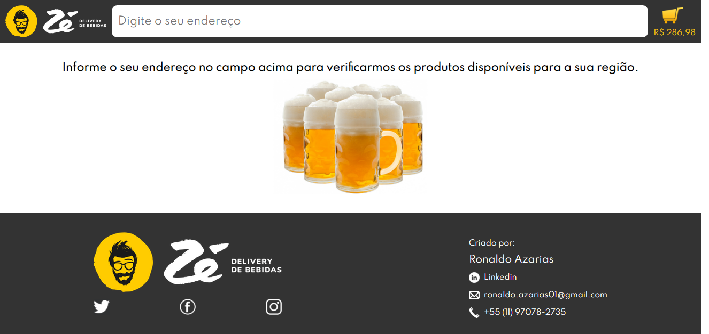
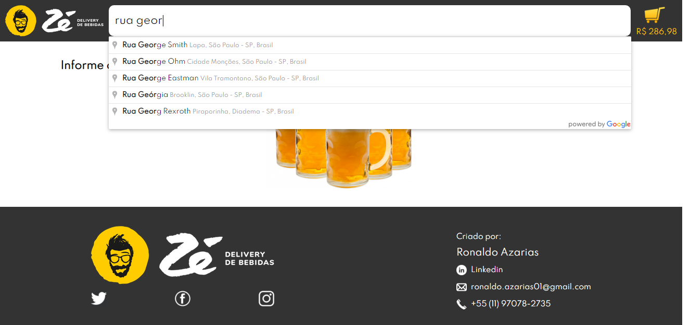
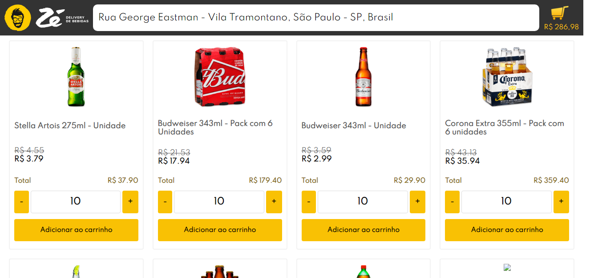
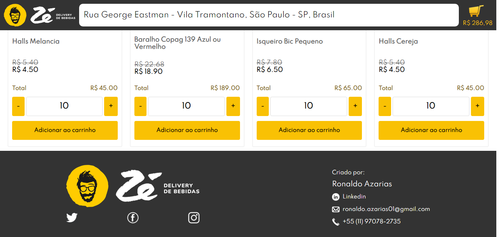
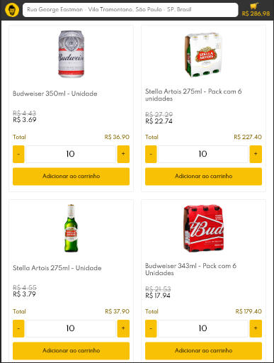
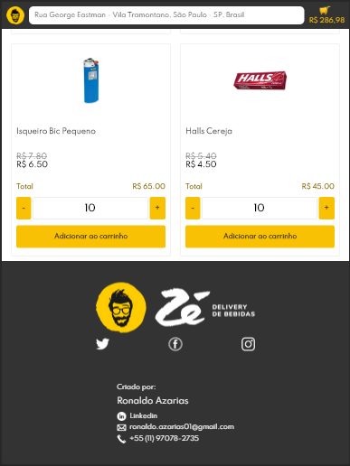
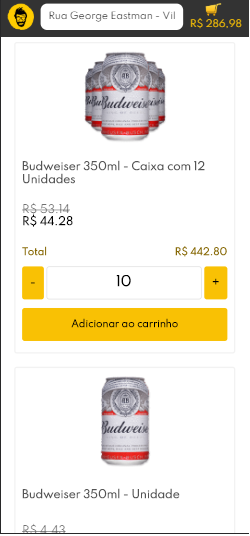

# ze-delivery-challenge

Conforme solicitado no desafio, aplicação pode ser executada através do comando "npm start".

Segue imagens com breve descrição.

<h2>Home</h2>

 

<h2>Home</h2>

Digitando o endereço para coletar geolocalização e posteriormente obter código de fornecedor para a região.

 

<h2>Produtos</h2>

Exibindo os produtos fornecidos pela api após consulta via GraphQL para o fornecedor obtido no passo anterior.

 

<h2>Produtos</h2>

Exibindo rodapé da página.

 

<h2>Home - Visão IPad</h2>

 

<h2>Produtos - Visão IPad</h2>

 

<h2>Home - Visão IPhone</h2>

 

<h2>Produtos - Visão IPhone</h2>

